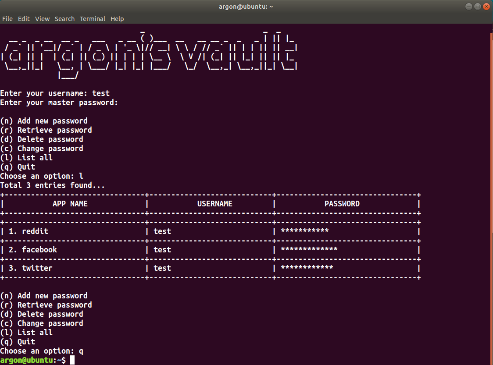

# Password-Manager
A terminal based python password manager, which securely saves the passwords and other credentials on a local sqlite database.
# Features
1. The entire program is encrypted with a single master password.
2. Master password is hashed and stored in a local sqlite database.
2. This will be required while logging in, deleting or retrieving the password.
3.  Each field is encrypted with a unique salt using AES-256 encryption with pycryptodome and then stored in the database.
# Required Modules
## Pycryptodome
> A self-contained cryptographic library for Python.
# Installation
1. Fork this repository
2. Clone your forked repository
```bash
git clone https://github.com/<your-github-username>/Password-Manager.git
```
3. Change the directory
```bash
cd Password-Manager
```
4. Run the program
```bash
python3 main.py
```
# Basic usage

